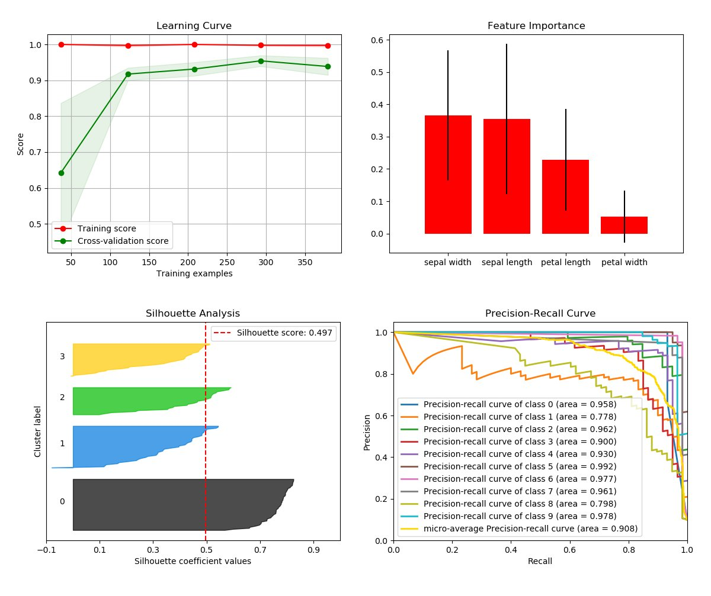
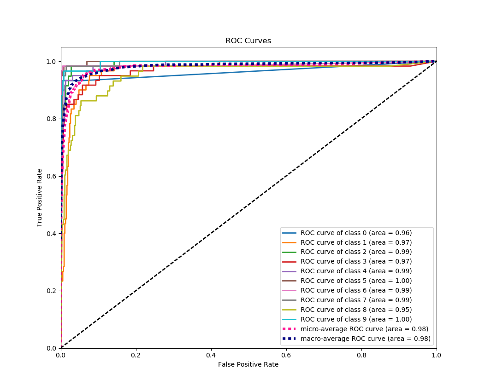
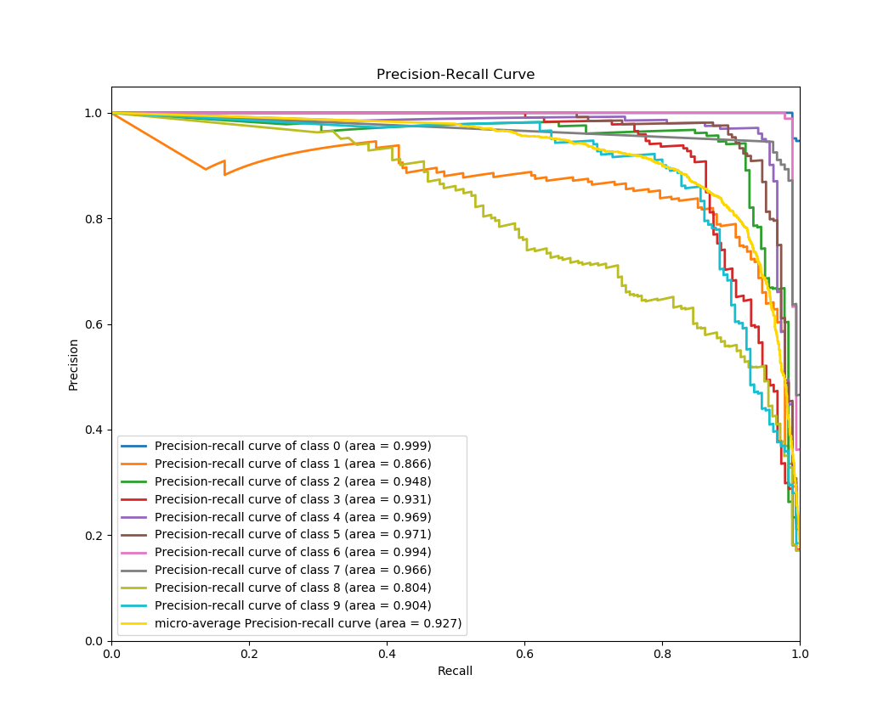

# Welcome to Scikit-plot

[](https://badge.fury.io/py/scikit-plot)
[]()
[](https://travis-ci.org/reiinakano/scikit-plot)
[]()
[](https://doi.org/10.5281/zenodo.293191)

### Single line functions for detailed visualizations

### The quickest and easiest way to go from analysis...



### ...to this.

Scikit-plot is the result of an unartistic data scientist's dreadful realization that *visualization is one of the most crucial components in the data science process, not just a mere afterthought*.

Gaining insights is simply a lot easier when you're looking at a colored heatmap of a confusion matrix complete with class labels rather than a single-line dump of numbers enclosed in brackets. Besides, if you ever need to present your results to someone (virtually any time anybody hires you to do data science), you show them visualizations, not a bunch of numbers in Excel.

That said, there are a number of visualizations that frequently pop up in machine learning. Scikit-plot is a humble attempt to provide aesthetically-challenged programmers (such as myself) the opportunity to generate quick and beautiful graphs and plots with as little boilerplate as possible.

## Okay then, prove it. Show us an example.

Say we use Naive Bayes in multi-class classification and decide we want to visualize the results of a common classification metric, the Area under the Receiver Operating Characteristic curve. Since the ROC is only valid in binary classification, we want to show the respective ROC of each class if it were the positive class. As an added bonus, let's show the micro-averaged and macro-averaged curve in the plot as well.

Let's use scikit-plot with the sample digits dataset from scikit-learn.

```python
# The usual train-test split mumbo-jumbo
from sklearn.datasets import load_digits
from sklearn.model_selection import train_test_split
from sklearn.naive_bayes import GaussianNB

X, y = load_digits(return_X_y=True)
X_train, X_test, y_train, y_test = train_test_split(X, y, test_size=0.33)
nb = GaussianNB()
nb.fit(X_train, y_train)
predicted_probas = nb.predict_proba(X_test)

# The magic happens here
import matplotlib.pyplot as plt
import scikitplot as skplt
skplt.metrics.plot_roc(y_test, predicted_probas)
plt.show()
```


Pretty.

And... That's it. Encaptured in that small example is the entire philosophy of Scikit-plot: **single line functions for detailed visualization**. You simply browse the plots available in the documentation, and call the function with the necessary arguments. Scikit-plot tries to stay out of your way as much as possible. No unnecessary bells and whistles. And when you *do* need the bells and whistles, each function offers a myriad of parameters for customizing various elements in your plots.

Finally, compare and [view the non-scikit-plot way of plotting the multi-class ROC curve](http://scikit-learn.org/stable/auto_examples/model_selection/plot_roc.html). Which one would you rather do?

## Maximum flexibility. Compatibility with non-scikit-learn objects.

Although Scikit-plot is loosely based around the scikit-learn interface, you don't actually need Scikit-learn objects to use the available functions. As long as you provide the functions what they're asking for, they'll happily draw the plots for you.

Here's a quick example to generate the precision-recall curves of a Keras classifier on a sample dataset.

```python
# Import what's needed for the Functions API
import matplotlib.pyplot as plt
import scikitplot as skplt

# This is a Keras classifier. We'll generate probabilities on the test set.
keras_clf.fit(X_train, y_train, batch_size=64, nb_epoch=10, verbose=2)
probas = keras_clf.predict_proba(X_test, batch_size=64)

# Now plot.
skplt.metrics.plot_precision_recall_curve(y_test, probas)
plt.show()
```


You can see clearly here that `skplt.metrics.plot_precision_recall_curve` needs only the ground truth y-values and the predicted probabilities to generate the plot. This lets you use *anything* you want as the classifier, from Keras NNs to NLTK Naive Bayes to that groundbreaking classifier algorithm you just wrote.

The possibilities are endless.

## Installation

Installation is simple! First, make sure you have the dependencies [Scikit-learn](http://scikit-learn.org) and [Matplotlib](http://matplotlib.org/) installed.

Then just run:
```bash
pip install scikit-plot
```

Or if you want the latest development version, clone this repo and run
```bash
python setup.py install
```
at the root folder.

If using conda, you can install Scikit-plot by running:
```bash
conda install -c conda-forge scikit-plot
```

## Documentation and Examples

Explore the full features of Scikit-plot.

You can find detailed documentation [here](http://scikit-plot.readthedocs.io).

Examples are found in the [examples folder of this repo](examples/).

## Contributing to Scikit-plot

Reporting a bug? Suggesting a feature? Want to add your own plot to the library? Visit our [contributor guidelines](CONTRIBUTING.md).

## Citing Scikit-plot

Are you using Scikit-plot in an academic paper? You should be! Reviewers love eye candy.

If so, please consider citing Scikit-plot with DOI [](https://doi.org/10.5281/zenodo.293191)

#### APA

> Reiichiro Nakano. (2018). reiinakano/scikit-plot: 0.3.7 [Data set]. Zenodo. http://doi.org/10.5281/zenodo.293191

#### IEEE

> [1]Reiichiro Nakano, “reiinakano/scikit-plot: 0.3.7”. Zenodo, 19-Feb-2017.

#### ACM

> [1]Reiichiro Nakano 2018. reiinakano/scikit-plot: 0.3.7. Zenodo.

Happy plotting!
