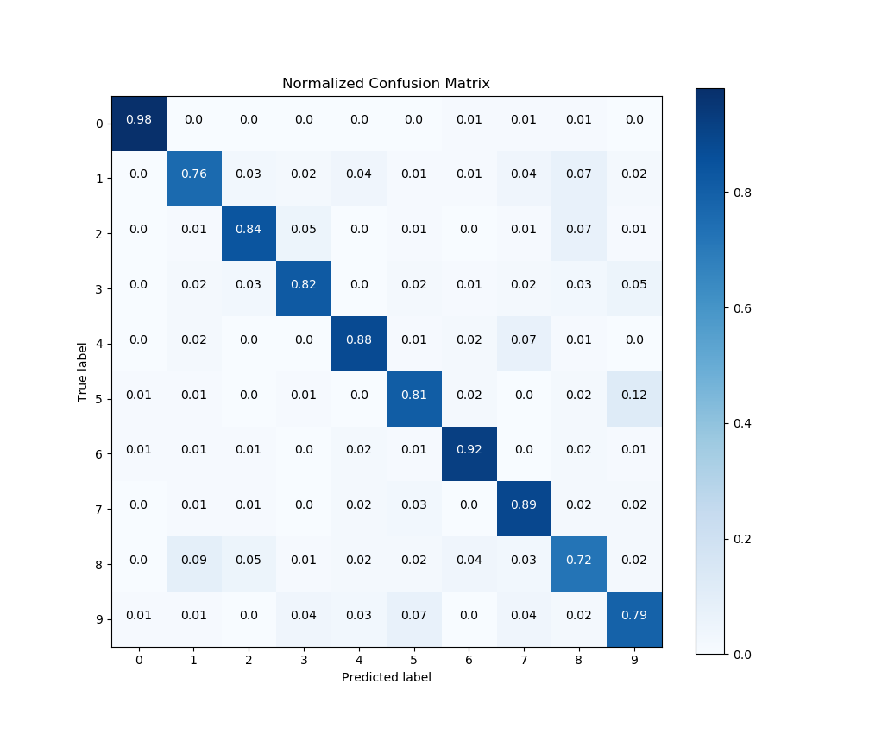
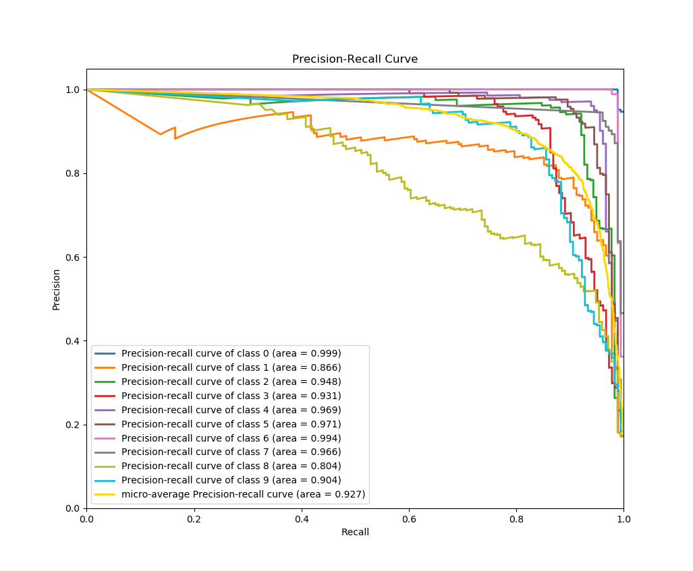

.. Quickstart file describing a quick plot with scikit-plot

First steps with Scikit-plot
============================

Eager to use Scikit-plot? Let's get started! This section of the documentation will teach you the basic philosophy behind Scikit-plot by running you through a quick example.

Installation
------------

Before anything else, make sure you've installed the latest version of Scikit-plot. Scikit-plot is on PyPi, so simply run::

    $ pip install scikit-plot

to install the latest version.

Alternatively, you can clone the `source repository <https://github.com/reiinakano/scikit-plot>`_ and run::

    $ python setup.py install

at the root folder.

Scikit-plot depends on `Scikit-learn <http://scikit-learn.org/>`_ and `Matplotlib <http://matplotlib.org/>`_ to do its magic, so make sure you have them installed as well.

Your First Plot
---------------

For our quick example, let's show how well a Random Forest can classify the digits dataset bundled with Scikit-learn. A popular way to evaluate a classifier's performance is by viewing its confusion matrix.

Before we begin plotting, we'll need to import the following for Scikit-plot::

    >>> import matplotlib.pyplot as plt

:mod:`matplotlib.pyplot` is used by Matplotlib to make plotting work like it does in MATLAB and deals with things like axes, figures, and subplots. But don't worry. Unless you're an advanced user, you won't need to understand any of that while using Scikit-plot. All you need to remember is that we use the :func:`matplotlib.pyplot.show` function to show any plots generated by Scikit-plot.

Let's begin by generating our sample digits dataset::

    >>> from sklearn.datasets import load_digits
    >>> X, y = load_digits(return_X_y=True)

Here, ``X`` and ``y`` contain the features and labels of our classification dataset, respectively.

We'll proceed by creating an instance of a RandomForestClassifier object from Scikit-learn with some initial parameters::

    >>> from sklearn.ensemble import RandomForestClassifier
    >>> random_forest_clf = RandomForestClassifier(n_estimators=5, max_depth=5, random_state=1)

Let's use :func:`sklearn.model_selection.cross_val_predict` to generate predicted labels on our dataset::

    >>> from sklearn.model_selection import cross_val_predict
    >>> predictions = cross_val_predict(random_forest_clf, X, y)

For those not familiar with what :func:`cross_val_predict` does, it generates cross-validated estimates for each sample point in our dataset. Comparing the cross-validated estimates with the true labels, we'll be able to get evaluation metrics such as accuracy, precision, recall, and in our case, the confusion matrix.

To plot and show our confusion matrix, we'll use the function :func:`~scikitplot.metrics.plot_confusion_matrix`, passing it both the true labels and predicted labels. We'll also set the optional argument ``normalize=True`` so the values displayed in our confusion matrix plot will be from the range [0, 1]. Finally, to show our plot, we'll call ``plt.show()``.

    >>> import scikitplot as skplt
    >>> skplt.metrics.plot_confusion_matrix(y, predictions, normalize=True)
    <matplotlib.axes._subplots.AxesSubplot object at 0x7fe967d64490>
    >>> plt.show()

And that's it! A quick glance of our confusion matrix shows that our classifier isn't doing so well with identifying the digits 1, 8, and 9. Hmm. Perhaps a bit more tweaking of our Random Forest's hyperparameters is in order.

One more example
----------------

Finally, let's show an example wherein we *don't* use Scikit-learn.

Here's a quick example to generate the precision-recall curves of a Keras classifier on a sample dataset.

    >>> # Import what's needed for the Functions API
    >>> import matplotlib.pyplot as plt
    >>> import scikitplot as skplt
    >>> # This is a Keras classifier. We'll generate probabilities on the test set.
    >>> keras_clf.fit(X_train, y_train, batch_size=64, nb_epoch=10, verbose=2)
    >>> probas = keras_clf.predict_proba(X_test, batch_size=64)
    >>> # Now plot.
    >>> skplt.metrics.plot_precision_recall_curve(y_test, probas)
    <matplotlib.axes._subplots.AxesSubplot object at 0x7fe967d64490>
    >>> plt.show()

And again, that's it! As in the example above, all we needed to do was pass the ground truth labels and predicted probabilities to :func:`~scikitplot.metrics.plot_precision_recall_curve` to generate the precision-recall curves. This means you can use literally any classifier you want to generate the precision-recall curves, from Keras classifiers to NLTK Naive Bayes to XGBoost, as long as you pass in the predicted probabilities in the correct format.

Now what?
---------

The recommended way to start using Scikit-plot is to just go through the documentation for the various modules and choose which plots you think would be useful for your work.

Happy plotting!
